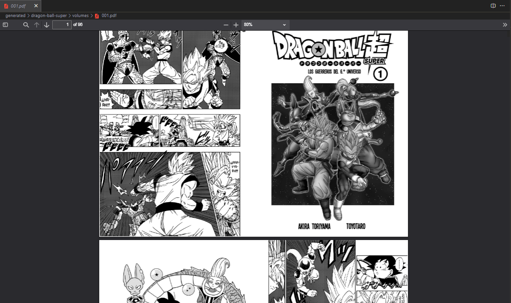

# Manga PDF Maker

Convert your **manga image files** into an **organized PDF** ready for printing and binding.

## The Problem

I have a **Comic Book RAR (.cbr)** file of my favorite anime (Dragon Ball) that I downloaded "LEGALLY".

This type of file is a collection of images of each page of the manga.

To view the content, I found 2 options:

1. Unzip the .cbr file with WinRAR and view all the images with the help of Windows.
2. Download an desktop application that allows to process and view .cbr files.

In order not to spend too much time in front of the computer, it occurred to me to put all these images together in a **PDF file** in an order that, when printed **double-sided**, follows a correct reading sequence, and that is also easy to bind.

## The Solution

I found a GitHub repository called [MangaPrinter](https://github.com/yonixw/MangaPrinter) created by user **yonixw**, which proposes a more complete solution to this problem. It is a desktop application that allows to load all manga image files, customize them, organize them, and export them in a printable PDF file. Highly recommended.

Although, it is a good solution to the above mentioned problem, I propose a simpler to implement and less user friendly solution.

1. It is simpler to implement because it is a single simple **JavaScript file**, which I run with the help of **NodeJS**, and get almost the same result.
2. It is less user friendly because, I force the user to have programming knowledge, and to perform more manual procedures. But, at least for me, it is faster to execute a **2KB script**, than to download a desktop application of a bigger weight.

## Procedures

1. As a first step, you must clone this GitHub repository and your computer `git clone https://github.com/gitchaell/manga-pdf-maker.git`.

2. Open the cloned folder in your favorite code editor. In the directory where the `package.json` file is located, install the project dependencies with the command `npm install`.

3. At the same level of the `src/` directory, create a directory named `assets/`, and another one named `generated`. In both directories, create a subfolder with the name of your manga. Then, in both directories, create a subfolder named `volumes/`. In the `assets/<manga>/volumes/**/*.png` directory, there will be all the image files of your manga grouped by volume, and in the `generated/<manga>/volumes/*.pdf` directory, there will be all the generated PDF files of your manga, grouped by volume.

4. Download the `.cbr` files of your manga and unzip the images in the `assets/<manga>/volumes/` directory. Make sure that all images are sorted according to their filename, and that all images have a vertical orientation.

    - At this point, the folder structure should look as shown below.

    

5. Open the `src/app/js` file and edit line of code 7 with the name of your manga that you assigned to the directory created in step 3, and save the changes.

    ```javascript
    const MANGA_NAME = '<manga>'; // modify this
    const ASSETS_DIR = `./assets/${MANGA_NAME}/volumes`;
    const GENERATED_DIR = `./generated/${MANGA_NAME}/volumes`;
    ```

6. Finally, open the terminal and run the command `npm run start:app` and wait for the PDF files to be ready. You can see it in the `generated/<manga>/volumes/*.pdf` folder.

    

7. If you are going to print the PDF, make sure to set up double-sided printing. In the case of printing from Google Chrome, you can print the odd pages first, and then the even pages on the reverse side of the odd pages.

    
